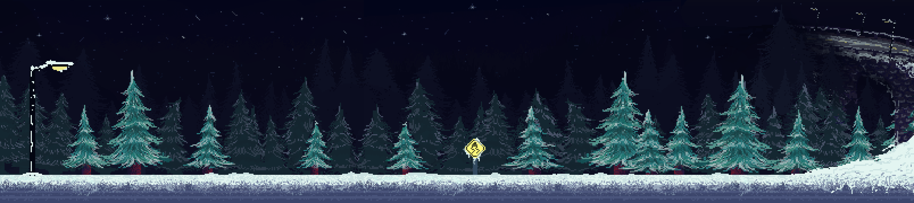

# Heaven's Eve 🎄✨

**Heaven's Eve** es un videojuego interactivo en estilo *pixel art* que explora una historia profunda sobre el arrepentimiento, el duelo y el amor familiar. Desarrollado en Unity, el juego busca generar un impacto emocional fuerte en el jugador a través de su narrativa y su atmósfera.

---

## Sinopsis

El juego trata sobre el profundo arrepentimiento que siente un padre debido a su ausencia con su familia. En plena víspera de Navidad, tras tener una fuerte discusión con su esposa, el protagonista sufre un trágico accidente automovilístico en un bosque helado. 

Su alma queda atrapada en el mundo de los vivos con una última y dolorosa misión: recorrer los escenarios, interactuar con los recuerdos y lograr entregarle los regalos de Navidad a su esposa e hija antes de que su tiempo se agote. A través de esta travesía, el jugador descubrirá la historia detrás del accidente y el peso de una despedida.

---

## Mecánicas y Características

* **Atmósfera Emocional:** El escenario principal es un bosque nocturno cubierto de nieve que genera incertidumbre y suspenso. Los colores de la casa reflejan la distancia y la frialdad de un hogar fracturado.
* **Narrativa Visual Cohesiva:** Se utiliza una paleta de colores fríos y apagados para el padre (reflejando su estado espectral y su melancolía), mientras que la madre y la hija visten colores vivos y navideños para marcar la separación física y emocional entre ellos.
* **Interacción y Minijuegos:** Explora áreas clave como la Sala, el Cuarto de la Hija y el Sótano para resolver misiones secundarias e interactuar con objetos clave (como el árbol de navidad, fotos rotas o peluches) para desbloquear los regalos.
* **Enemigos y Aliados:**
    * *Almas Consejeras:* Entidades místicas que brindan ligera confianza e interactúan positivamente con el jugador.
    * *Almas Errantes:* Espíritus fríos y escalofriantes que actúan como enemigos a los que hay que temer.
* **UI Dinámica:** Cuenta con un sistema de inventario integrado en el maletín de trabajo del protagonista, un medidor de vida y un temporizador digital acechado por almas.

---

## Tecnologías Utilizadas

El proyecto fue desarrollado utilizando el siguiente ecosistema de herramientas:

* **[Unity](https://unity.com/)**: Motor principal de desarrollo para la programación de mecánicas, físicas 2D e integración de audio/UI.
* **[Visual Studio](https://visualstudio.microsoft.com/)**: IDE utilizado para la programación y *scripting* de comportamientos en C#.
* **[Krita](https://krita.org/)**: Herramienta utilizada para la conceptualización de escenarios, interfaces y bocetos iniciales de diseño.
* **[Aseprite](https://www.aseprite.org/)**: Software especializado para la creación del *pixel art*, retoque de color final, diseño de texturas y animaciones (*SpriteSheets*).
* **[GitHub](https://github.com/)**: Plataforma esencial para el control de versiones, permitiendo el trabajo colaborativo e integración del equipo de desarrollo.

---

## Equipo de Desarrollo

Este proyecto fue creado con mucho cariño y esfuerzo por:

* **[@LuzGarHdz](https://github.com/LuzGarHdz)** - *Programador*
* **[@yepono](https://github.com/yepono)** - *Artista Pixel Art / Animación / Diseño de Niveles*
* **Dean Velez** - *Narrativa y guión*

---

## Capturas del Juego

Pantalla de Inicio 

Bosque del accidente

---
*Desarrollado como proyecto de software/videojuegos - 2025.*
